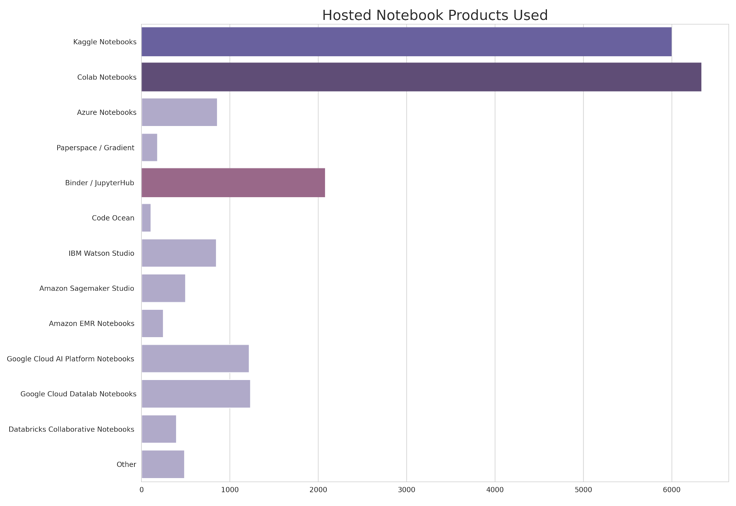
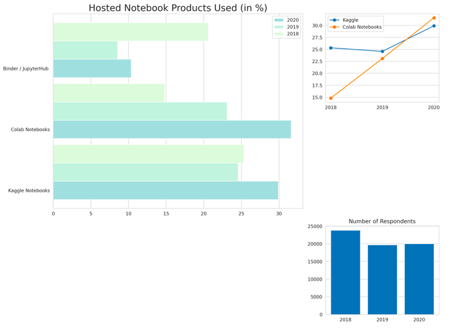
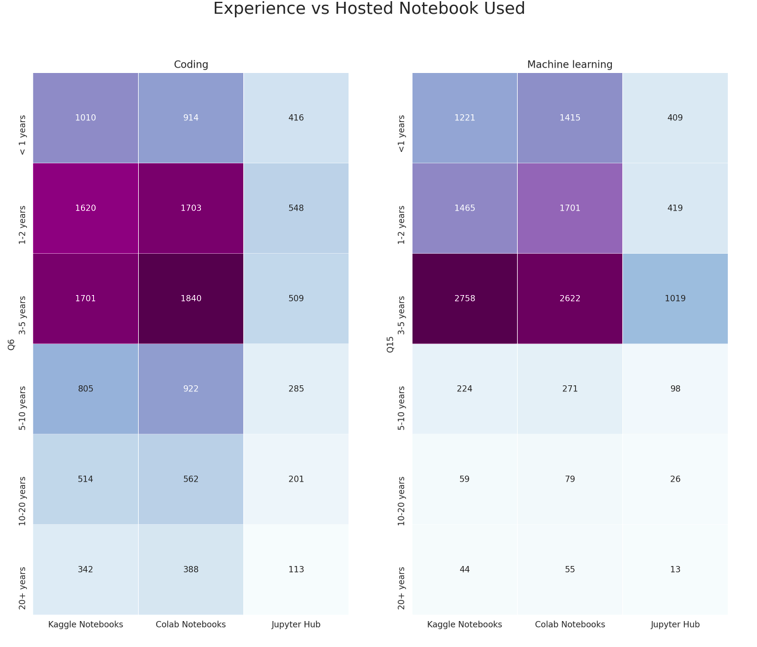
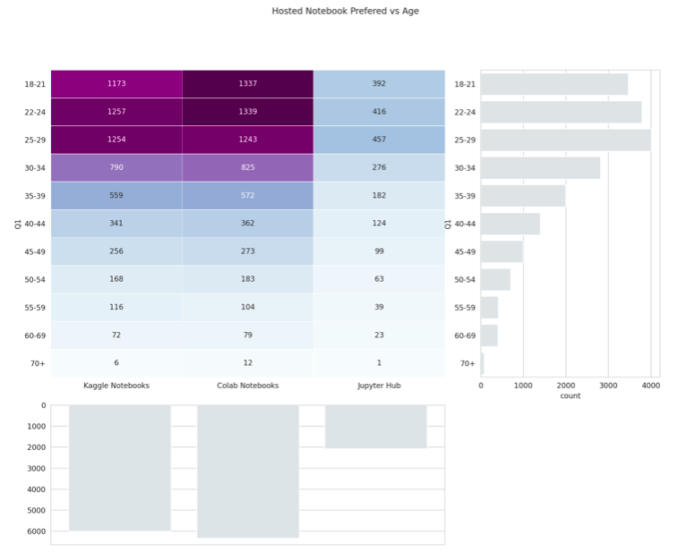
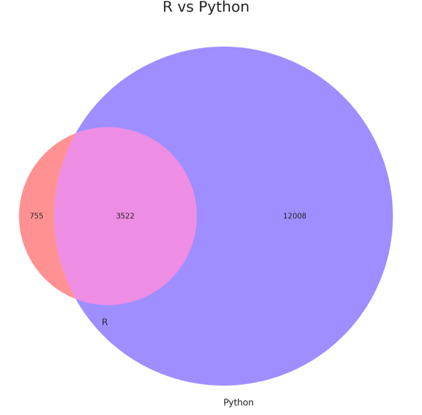
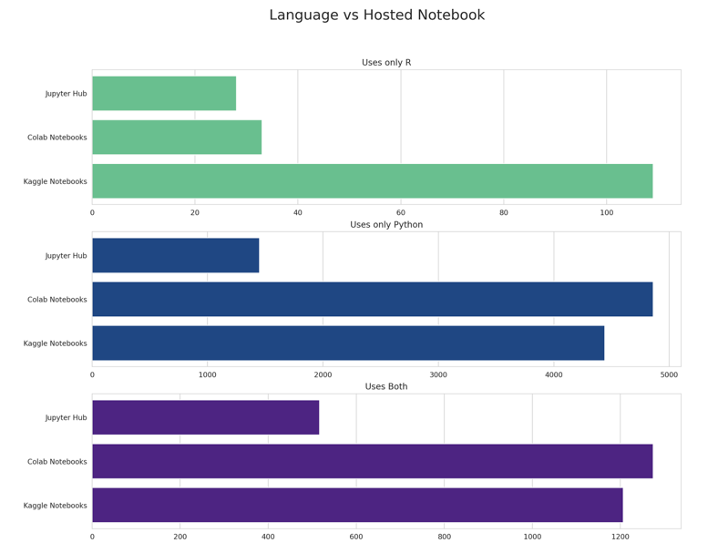
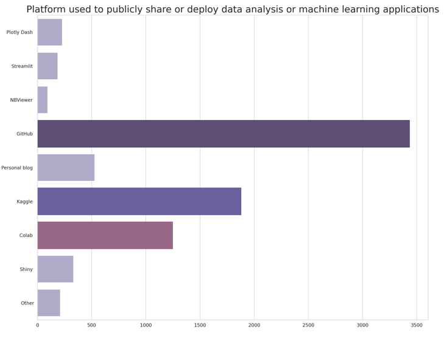

# Kaggle 2020 Survey Analysis
[Kaggle Notebook](https://www.kaggle.com/adityajha1504/kaggle-vs-colab-clash-of-brothers)

## Table of Content 

* [Overview](#overview) 
* [Motivation](#motivation) 
* [Dataset](#dataset) 
* [Frameworks Used](#frameworks-used) 
* [Data Visualisations](#data-visualisations) 
* [Insights Gathered](#insights-gathered) 


## Overview 
This is a data analysis project, to analyse the Kaggle DataScience 2020 Survey dataset, and gather insights about the Differences between Kaggle and Google Colab. 

## Motivation 
The purpose of this project is to tell a data story about a subset of the data science community represented in this survey, through a combination of both narrative text and data exploration. A “story” can be defined any number of ways, and that’s deliberate. The challenge of this project is to deeply explore (through data) the impact, priorities, or concerns of a specific group of data science and machine learning practitioners. That group can be defined in the macro (for example: anyone who does most of their coding in Python) or the micro (for example: female data science students studying machine learning in masters programs). This project's purpose is to be creative and tell the story of a community I identify with or am passionate about! 

## Dataset 
This year, as in 2017, 2018, and 2019 Kaggle set out to conduct an industry-wide survey that presents a truly comprehensive view of the state of data science and machine learning. The survey was live for 3.5 weeks in October, and after cleaning the data Kaggle finished with 20,036 responses! 

To download the dataset images go to the following link [dataset](https://www.kaggle.com/c/kaggle-survey-2020/data) or use the kaggle api by writing the following command ``` kaggle competitions download -c kaggle-survey-2020 ``` 

The data can be found in the folder (`kaggle-survey-2020/`) 

## Frameworks-used 
1. Numpy
2. Pandas
3. Matplotlib
4. Seaborn 

 <br>  
## Data-Visualisations
 
 
 
 
 
 
 

## Insights-Gathered

1.) Colab is the most popular in the field of Hosted Notebooks.

2.) Colab has had a rapid growth rate, if this continues, and if its competitors don't keep up with it's growth rate, Colab might become the King of Hosted Notebooks, beating every other Platform in this area, in the next few years.

3.)Colab is very beginner friendly when it comes to writing Code, especially Code which utilises Machine Learning Methods to solve a given problem, atleast when compared to its counterparts.

4.)Colab seems to have gained alot of its populartiy in the last two years, and thus the trend of people with less than 2 years of coding experience using Colab more seems to make a bit more sense.

5.)Kaggle does so much better than Colab in case of Popularity among R users, because Colab unlike Kaggle does not support R language, supports only Python and Swift. If you are a R user, and work primarily in R, then Kaggle is the Place to go to, Kaggle Notebooks support writing code in R, and there are more chances you will find other Kernels written in R in Kaggle than in Colab

6.)GitHub is the most popular Platform for sharing and deploying Code.

7.)Even when Kaggle and Colab are Platforms build specifically for Data Science, the people in Data Science use Github more than the above mentioned Platforms.

8.)People who use Kaggle or Colab usually use them in conjecture with using Github. Perhaps it is because the employers usually look at github profiles to decide if they want to hire and individual or not, so most of the Kaggle and Colab users have to upload their codes on Github as well.
